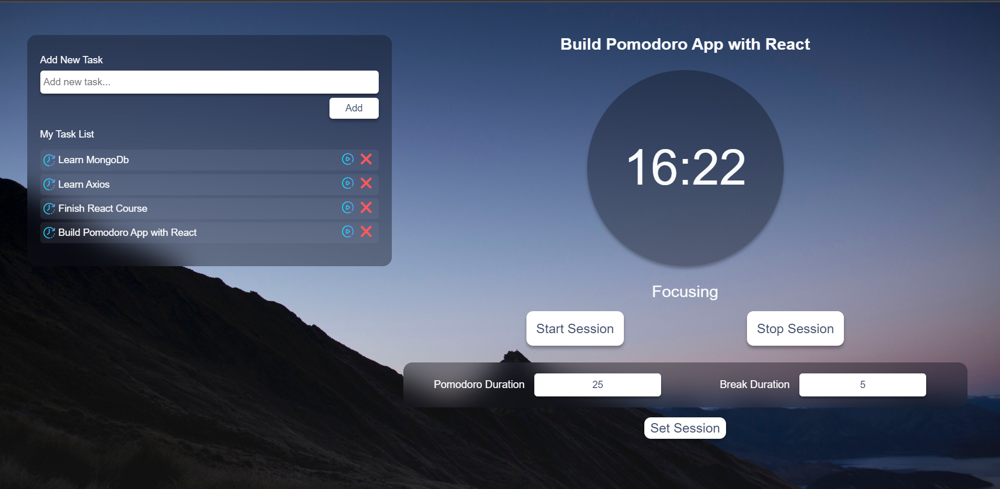

# Simple Pomodoro App with React

## Description
This is a very simple pomodoro application using react components and hooks. The application consist on a Todo list where you can list your tasks and set a focus on it. Next to the too list, you'll have the pomodoro timer, where youcan start the session, and stop it. You can also configure the duration of your session by specifying the pomodoro break duration.

## How to run it
Simply make a fork of the repository, clone it into your machine and install the dependencies

## Coming up
- Update taks by marking it as completed and providing a list of completed tasks
- Expand the pomodoro sessions by providing the number of pomodoros you want to have in one task
- If the number of pomodoros are more than two, suggest a long break to the user after the second pomodoro
- Connect to MongoDb Database to keep track of your sessions and productity

### Author
Kevin Grimaldi
